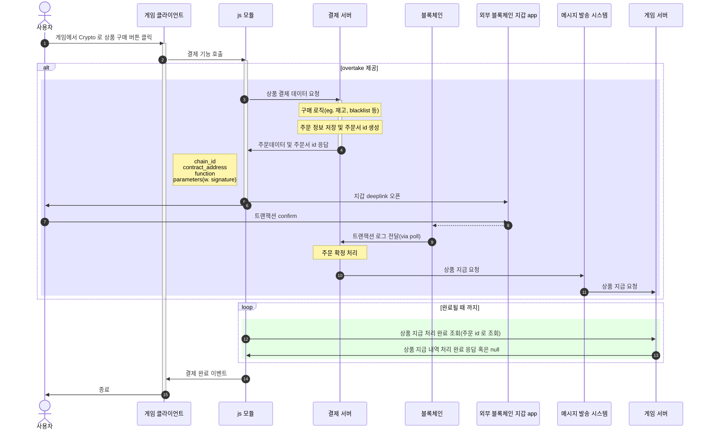

# 암호화폐 결제

```mermaid
sequenceDiagram
    autonumber
actor user as 사용자
participant game as 게임 클라이언트
participant js as js 모듈
participant payment as 결제 서버
participant chain as 블록체인
participant wallet-app as 외부 블록체인 지갑 app
participant sns as 메시지 발송 시스템
participant game-ser as 게임 서버

user ->> game: 게임에서 Crypto 로 상품 구매 버튼 클릭
activate game
game ->> js: 결제 기능 호출
activate js
alt overtake 제공
rect rgba(0, 0, 255, .1)
	js ->> payment: 상품 결제 데이터 요청
	activate payment
	Note over payment: 구매 로직(eg. 재고, blacklist 등)
	Note over payment: 주문 정보 저장 및 주문서 id 생성
	
	payment ->> js: 주문데이터 및 주문서 id 응답
		deactivate payment
	Note left of js: chain_id<br>contract_address<br>function<br>parameters(w. signature)

	
	js ->> wallet-app: 지갑 deeplink 오픈
	js ->> user: 
	deactivate js
	user ->> wallet-app: 트랜잭션 confirm
	wallet-app -->> chain: 
	chain ->> payment: 트랜잭션 로그 전달(via poll)
	Note over payment: 주문 확정 처리
	
	payment ->> sns: 상품 지급 요청
	sns ->> game-ser: 상품 지급 요청
end
end
loop 완료될 때 까지
	rect rgba(0, 255, 0, .1)
	js ->> game-ser: 상품 지급 처리 완료 조회(주문 id 로 조회)
	game-ser ->> js: 상품 지급 내역 처리 완료 응답 혹은 null
	end
end

js ->> game: 결제 완료 이벤트
game ->> user: 종료

deactivate game

```