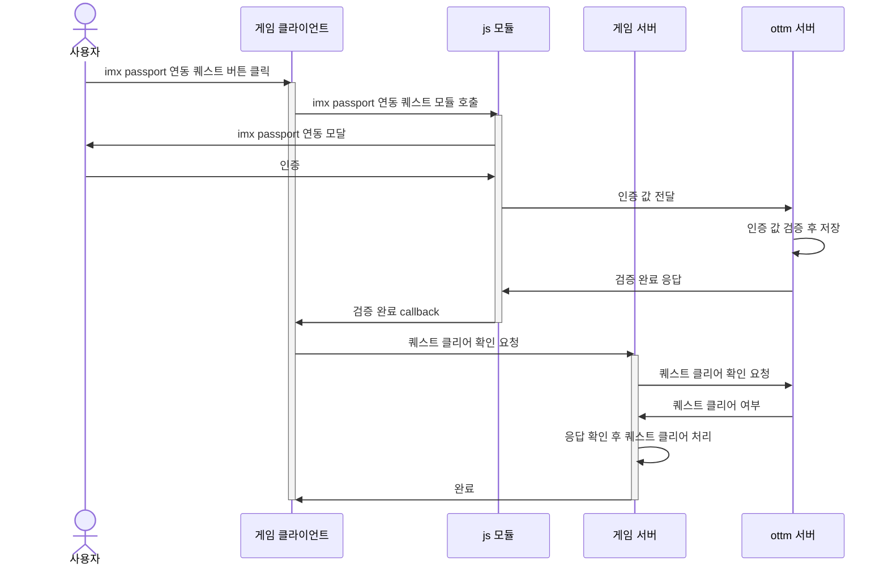

# Imx passport 연동 퀘스트

```mermaid
sequenceDiagram
actor user as 사용자
participant game as 게임 클라이언트
participant js as js 모듈
participant game-ser as 게임 서버
participant ottm as ottm 서버

user ->> game: imx passport 연동 퀘스트 버튼 클릭

activate game
game ->> js: imx passport 연동 퀘스트 모듈 호출
activate js
js ->> user: imx passport 연동 모달
user ->> js: 인증
js ->> ottm: 인증 값 전달
ottm ->> ottm: 인증 값 검증 후 저장
ottm ->> js: 검증 완료 응답
js ->> game: 검증 완료 callback
deactivate js
game ->> game-ser: 퀘스트 클리어 확인 요청
activate game-ser
game-ser ->> ottm: 퀘스트 클리어 확인 요청
ottm ->> game-ser: 퀘스트 클리어 여부 
game-ser ->> game-ser: 응답 확인 후 퀘스트 클리어 처리
game-ser ->> game: 완료
deactivate game-ser

deactivate game

```