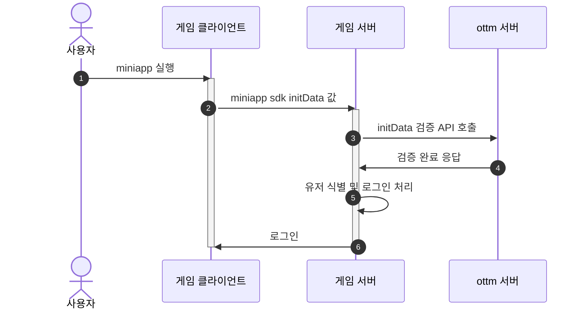

# 텔레그램 InitData 검증

```mermaid
sequenceDiagram
    autonumber
actor user as 사용자
participant game as 게임 클라이언트
participant game-ser as 게임 서버
participant ottm as ottm 서버

user ->> game: miniapp 실행

activate game
game ->> game-ser: miniapp sdk initData 값

activate game-ser
game-ser ->> ottm: initData 검증 API 호출
ottm ->> game-ser: 검증 완료 응답
game-ser ->> game-ser: 유저 식별 및 로그인 처리
game-ser ->> game: 로그인
deactivate game-ser

deactivate game

```