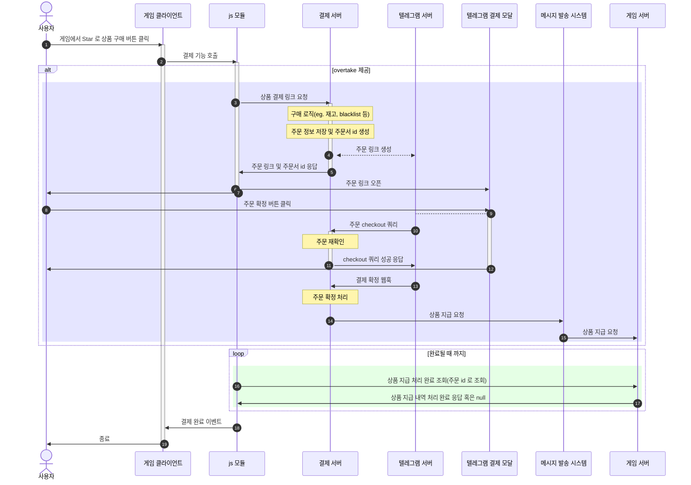

# 텔레그램 Star 결제

```mermaid
sequenceDiagram
    autonumber
actor user as 사용자
participant game as 게임 클라이언트
participant js as js 모듈
participant payment as 결제 서버
participant tg-ser as 텔레그램 서버
participant tg-app as 텔레그램 결제 모달
participant sns as 메시지 발송 시스템
participant game-ser as 게임 서버

user ->> game: 게임에서 Star 로 상품 구매 버튼 클릭
activate game
game ->> js: 결제 기능 호출
activate js
alt overtake 제공
rect rgba(0, 0, 255, .1)
	js ->> payment: 상품 결제 링크 요청
	activate payment
	Note over payment: 구매 로직(eg. 재고, blacklist 등)
	Note over payment: 주문 정보 저장 및 주문서 id 생성
	
	payment <<-->> tg-ser: 주문 링크 생성
	payment ->> js: 주문 링크 및 주문서 id 응답
	deactivate payment
	
	js ->> tg-app: 주문 링크 오픈
	js ->> user: 
	deactivate js
	user ->> tg-app: 주문 확정 버튼 클릭
	activate tg-app
	tg-app --> tg-ser: 
	tg-ser ->> payment: 주문 checkout 쿼리
	activate payment
	Note over payment: 주문 재확인
	payment ->> tg-ser: checkout 쿼리 성공 응답
	deactivate payment
	
	tg-app ->> user: 
	deactivate tg-app
	
	tg-ser ->> payment: 결제 확정 웹훅
	Note over payment: 주문 확정 처리
	payment ->> sns: 상품 지급 요청
	sns ->> game-ser: 상품 지급 요청
end
end
loop 완료될 때 까지
	rect rgba(0, 255, 0, .1)
	js ->> game-ser: 상품 지급 처리 완료 조회(주문 id 로 조회)
	game-ser ->> js: 상품 지급 내역 처리 완료 응답 혹은 null
	end
end

js ->> game: 결제 완료 이벤트
game ->> user: 종료

deactivate game

```