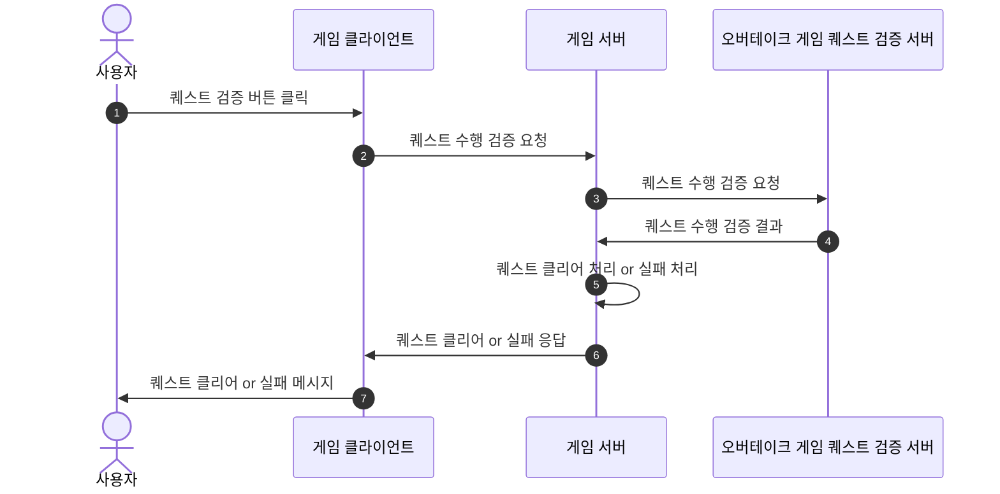

# 게임 퀘스트

## 게임 퀘스트란?
게임 퀘스트는 오버테이크와 연관된 인게임의 퀘스트 클리어 여부를 검증 하는 기능 입니다

## FLOW

```mermaid
sequenceDiagram
    autonumber
    actor user as 사용자
    participant game-cli as 게임 클라이언트
    participant game-ser as 게임 서버
    participant overtake as 오버테이크 게임 퀘스트 검증 서버
    
    user ->> game-cli: 퀘스트 검증 버튼 클릭
    game-cli ->> game-ser: 퀘스트 수행 검증 요청
    game-ser ->> overtake: 퀘스트 수행 검증 요청
    overtake ->> game-ser: 퀘스트 수행 검증 결과
    game-ser ->> game-ser: 퀘스트 클리어 처리 or 실패 처리
    game-ser ->> game-cli: 퀘스트 클리어 or 실패 응답
    game-cli ->> user: 퀘스트 클리어 or 실패 메시지
```