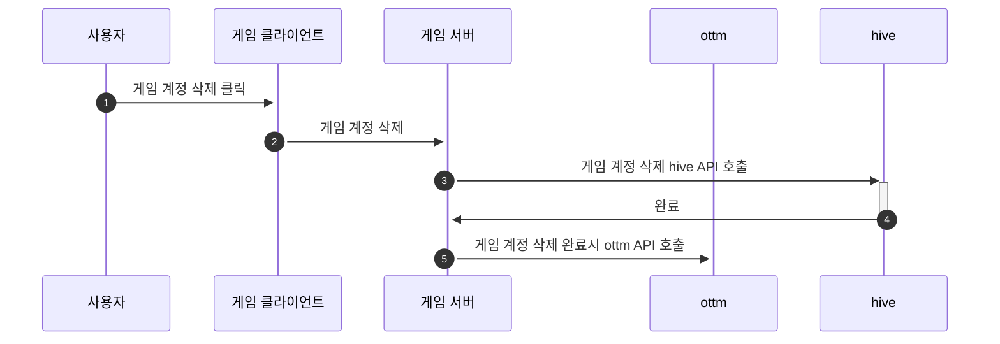

# 게임 계정 삭제

### 개요

1. OTTM 플랫폼에서도 회원의 게임 계정 삭제 여부를 저장하기 위해 게임서버에서 회원 계정 삭제시 호출해야 하는 API 입니다.

### **Flow**



### 게임 계정 삭제 완료

1. **게임 계정 삭제 완료** 
    - **Request**
        - **METHOD**
            - POST
        - **URL**
            - 개발환경: %api-base%/oauth2/v1/deletion/complete
            - 상용환경: %api-prod-base%/oauth2/v1/deletion/complete
        - **Content-Type**
            - application/json
        - **BODY**
            - ottm_member_uid
                - 로그인시 반환 된(sub) ottm 회원의 고유한 id 값
            - client_id
                - 애플리케이션의 클라이언트 ID
            - client_secret
                - 애플리케이션의 클라이언트 SECRET
    - **sample request**

        ```
        curl -X POST \
        '%api-base%/oauth2/v1/withdraw' \
        --data '{
                  "ottm_member_uid": "1111",
                  "client_id": "xxx",
                  "client_secret": "xxxx"
                }'
        ```

    - **sample response**

        ```
        {
           "error": null,
           "payload": null
        }
        ```

## ERROR

- format

    ```
    {
      "error": {
        "code": "10051",
        "message": "Invalid request"
      },
      "payload": null
    }
    ```

-

| code | message | Description                               | HTTP Status |
| --- | --- |-------------------------------------------| --- |
| 10051 | Invalid request | 요청이 잘못되었습니다.                              | 400 |
| 10073 | Invalid oauth2 client | client_id 또는 client_secret 이 잘못 되었습니다.    | 400 |

### Hive 계정 삭제 API

참고
- [https://developers.withhive.com/ko/dev4/authv4/idp-connect-helper/#idp-disconnect-leave-one-connected](https://developers.withhive.com/ko/dev4/authv4/idp-connect-helper/#idp-disconnect-leave-one-connected)
- [https://developers.withhive.com/ko/api/hive-server-api/auth/authv4-account-deletion/](https://developers.withhive.com/ko/api/hive-server-api/auth/authv4-account-deletion/)