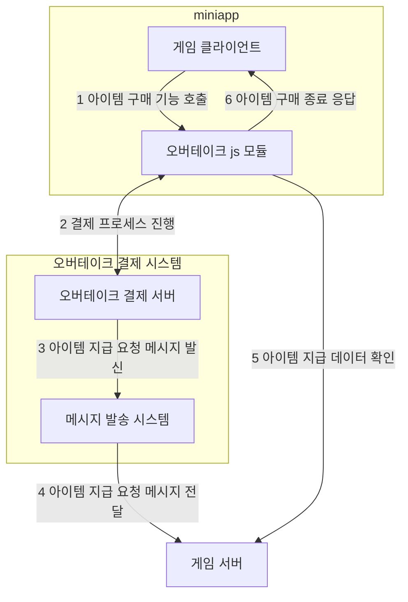

# 결제

## 개요
게임 결제 시스템은 플랫폼 화폐(eg. 텔레그램 Star)와 크립토 토큰 결제(eg. USDC) 를 추상화하여 게임에 일관된 인터페이스를 제공하기 위한 기능 입니다.

## 구조

### 텔레그램 미니앱

```mermaid
flowchart TB
game-ser[게임 서버]
subgraph miniapp
    game-cli[게임 클라이언트]
    jsmodule[오버테이크 js 모듈]
    game-cli -->|1 아이템 구매 기능 호출| jsmodule
end

subgraph 오버테이크 결제 시스템
	payment[오버테이크 결제 서버]
	sns[메시지 발송 시스템]
end
jsmodule <-->|2 결제 프로세스 진행| payment
payment -->|3 아이템 지급 요청 메시지 발신| sns
sns -->|4 아이템 지급 요청 메시지 전달| game-ser
jsmodule -->|5 아이템 지급 데이터 확인| game-ser
jsmodule -->|6 아이템 구매 종료 응답| game-cli

```