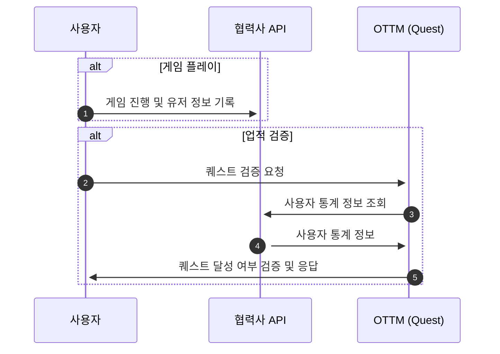

# 협력사 업적 정보 연동 절차

### 개요

- 이 문서는 협력사의 업적 서버와 OTTM 퀘스트 서버간의 업적 연동 절차에 대해 설명하고 있습니다.
- 달성할 퀘스트에 관련된 메타 정보는 사전에 OTTM과 공유가 되어있어야 합니다. 
- 유저가 OTTM의 멤버인 경우에만 연동이 가능합니다.

### 상세

#### 사용자 통계 정보
- OTTM MemberUid로 협력사의 API를 통하여 사용자 통계 정보 조회
  - 통계 정보의 예시: 사용자 레벨, 몬스터 처치 수, 재화 소모량, 마지막 로그인 시간 등
- 해당 유저의 정보가 없는 경우, 빈 응답 반환

#### 협력사 API 사용자 통계 정보 응답 Schema 예시

```json
{
  "member_uid": "example_member_uid", // 플레이어의 ottm member_uid: string
  "updated_at": "2024-07-23T12:14:22Z", // row 값 업데이트 UTC 시간: timestamp
  "created_at": "2024-07-18T11:41:42Z", // row 값 생성 UTC 시간: timestamp
  "player_lv": 10, // 플레이어 현재 레벨: int
  "gold_acquired": 1000000, // 누적 골드 획득량: bigint
  "gold_consumed": 500000, // 누적 골드 소모량: bigint
  "game_play_cnt": 150, // 누적 게임 플레이 횟수: int
  "game_win_cnt": 75, // 누적 승리 총 횟수: int
  "daily_mission_clear_cnt": 20, // 누적 일일 임무 완료 횟수: int
  "weekly_mission_clear_cnt": 5, // 누적 주간 임무 완료 횟수: int
  "login_at": "2024-07-23T12:14:22Z" // 마지막 로그인 UTC 시간: timestamp
}
```
#### 업적의 검증
- OTTM 퀘스트 서버에 업적 정보 및 조건 사전 등록
- OTTM WEB을 통하여 사용자가 검증 요청 시, 협력사 API를 통해 사용자 통계 정보 조회
- 해당 멤버의 업적 달성여부 판정 및 진행도 등록

### Flow


