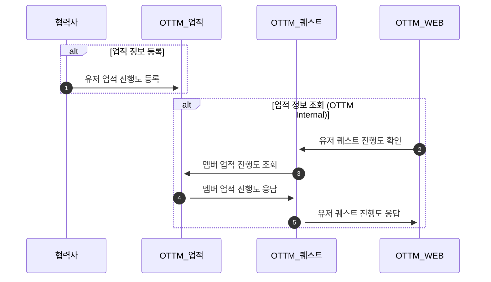

# 유저 업적 정보 등록(Achievement)
> [Open Api ui](%partner-api-base%/achievement/swagger-ui/index.html)
### 개요

- 이 문서는 협력사 유저의 업적 정보를 OTTM Achievement 서버 등록하는 절차에 대해 설명하고 있습니다.
- 달성한 업적에 관련된 메타 정보는 사전에 OTTM과 공유가 되어있어야 합니다. 
- 유저가 OTTM의 멤버인 경우에만 등록이 가능합니다.

### 상세
#### 업적 고유값
- 0~99999 의 값을 갖는 업적 별 고유값
- 10000자리 숫자를 통해, 업적의 유형 구분
  - 1***** (10000 ~ 19999) -> ONE_TIME Quest
  - 2***** (20000 ~ 29999) -> DAILY Quest
  - 3***** (30000 ~ 39999) -> WEEKLY Quest (추후 개발 예정)

#### 업적의 등록
- OTTM과 협의를 통하여 업적 별 고유값 (AchievementId) 사전 공유
- /member/record API를 통하여 유저 업적 정보 등록
- 업적 고유값을 기반으로 해당 업적 데이터의 유효기간 설정 (UTC 기준)
  - e.g.) DAILY(achievementId: 2*****) 05.24 09:53:31 에 수신 한 경우 -> 05.25 00:00:00 만료
  - e.g.) ONE_TIME (achievementId: 1*****) 05.24 09:53:31 에 수신 한 경우 -> 유효 기간 없음

#### 업적 등록이 거부되는 경우
- **OTTM MemberUid가 잘못 된 경우**
  - 진행도 정보가 잘못 된 경우
    - (현재 달성값 (numerator) < 목표값 (denominator)) 인데 Clear처리가 된 경우
    - (현재 달성값 (numerator) >= 목표값 (denominator)) 인데 Clear처리가 되지 않은 경우
    - (현재 달성값 (numerator), 목표값 (denominator)) 둘중 하나만 값이 들어오는 경우
    - 목표값 (denominator)이 0인 경우
- **achievementId가 잘못 된 경우**
  - 현재 지원 가능한 ONE_TIME, DAILY 이외의 값이 수신되는 경우
    - (0~9999) 또는 (40000 ~ 99999)
    - WEEKLY 업적 정보는 등록은 가능하나, OTTM 플랫폼상의 Quest는 추후 지원 예정
    
### Flow

