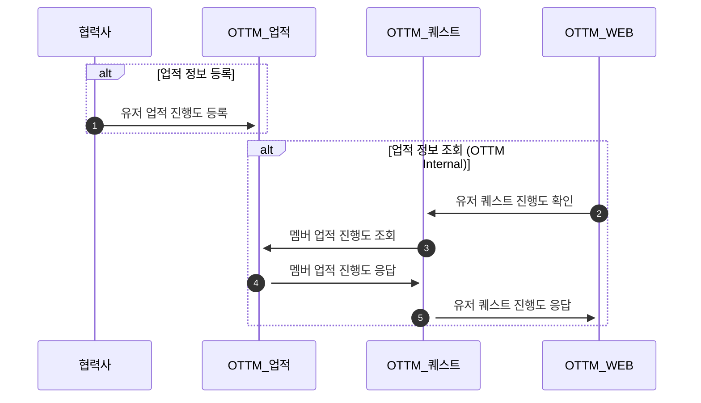

# 유저 업적 정보 등록(Achievement)
> [Open Api ui](%partner-api-base%/achievement/swagger-ui/index.html)
### 개요

1. OTTM Achievement 서버를 통해 유저의 업적 진행도 정보를 연동할 수 있습니다
2. 달성한 업적에 관련된 메타 정보는 사전에 OTTM과 공유가 되어있어야 합니다.
3. 유저가 OTTM의 멤버인 경우에만 연동이 가능합니다.

### **Flow**

