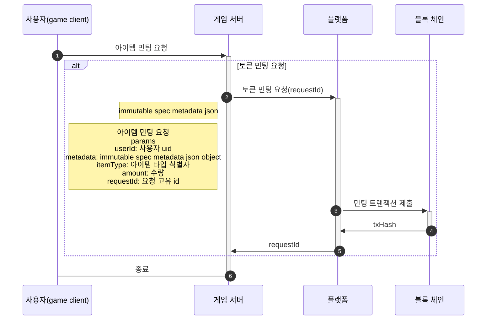
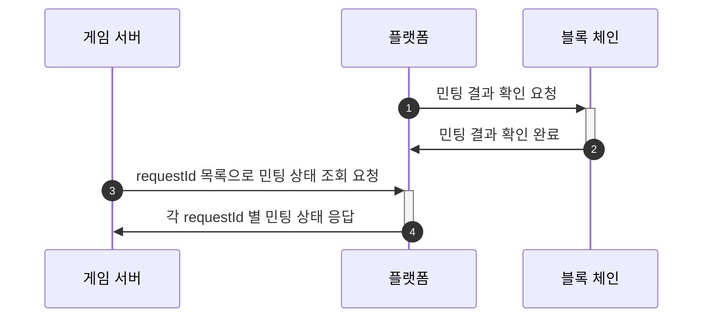
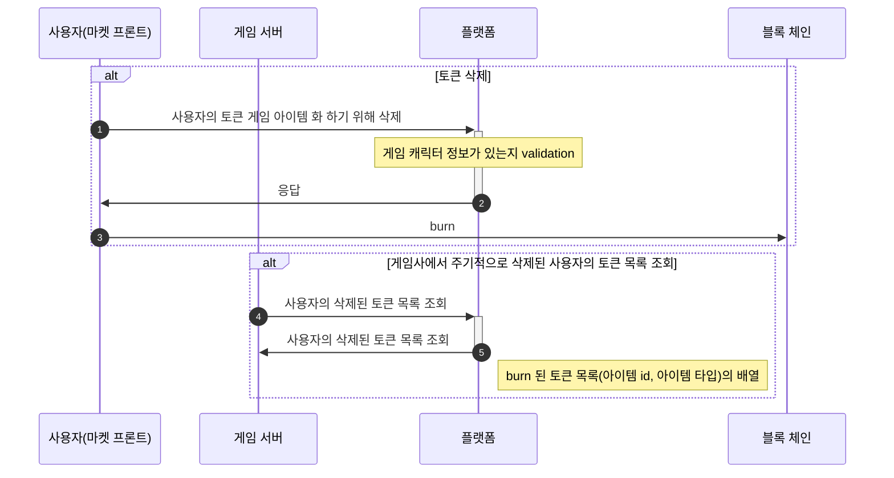
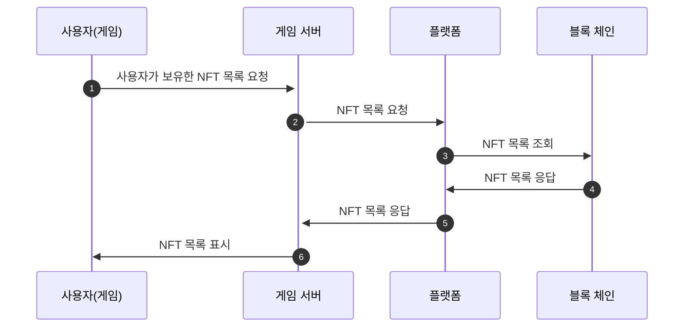
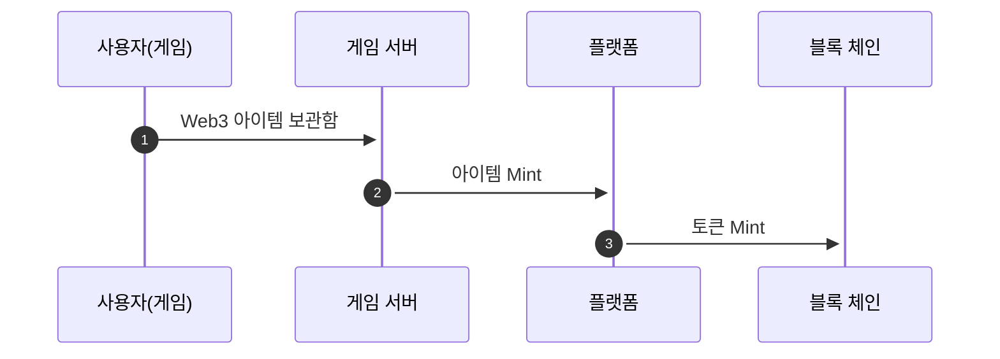
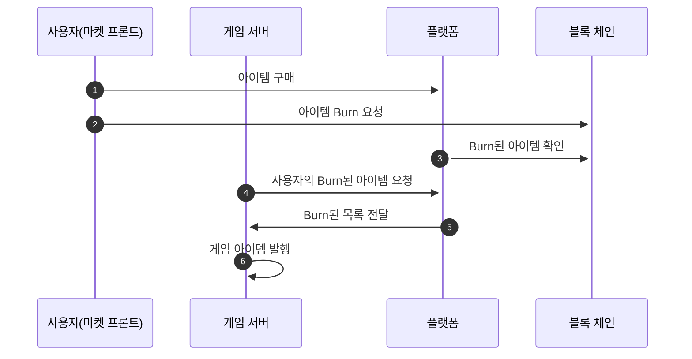

# 토큰 발행 & 삭제(Ramp)
> [Open Api ui](%partner-api-base%/ramp/swagger-ui/index.html)

### 개요

- 이 문서는 게임 아이템을 토큰(NFT)으로 발행하거나 사용자가 토큰을 소각(BURN)하여 게임으로 아이템을 가져오는 전체적인 절차, API 사양, 그리고 플로우를 설명합니다.

### 상세
#### 용어

다음은 해당 문서를 이해하기 위해 필요한 용어 목록입니다

| 용어               | 의미                                                                                                           | 동의어                              |
|------------------|--------------------------------------------------------------------------------------------------------------|----------------------------------|
| 민트(mint)         | 새로운 토큰을 블록체인에 생성하는 행위. ERC-721 에서 새로운 토큰은 새로운 id 를 가지고, ERC-1155 에선 새로운 id 로 민팅 할 수 있고, 기 존재하던 id 로 민팅할 수 있음 | 민팅(minting)                      |
| 토큰 발행            |                                                                                                              |                                  |
| 번(burn)          | 블록체인에서 토큰을 삭제하는 행위. ERC-721 에서 토큰 id 를 지정해서 삭제할 수 있고, ERC-1155 에서 토큰 id 와 삭제할 수량을 지정해서 삭제할 수 있음.             | 토큰 소각                            |
| ERC-721          | 각 토큰이 고유한 가치를 지닌 스마트 컨트랙트 표준                                                                                 |                                  |
| ERC-1155         | 같은 가치를 지닌 토큰이 여러개 있을 수 있는 스마트 컨트랙트 표준                                                                        |                                  |
| 컨트랙트             | 스마트 컨트랙트 약어                                                                                                  | 스마트 컨트랙트(Smart contract 이하, SMC) |
| minterKey        | 토큰을 민트할 수 있는 키(플랫폼이 보유함)                                                                                     |                                  |
| 요청 id(requestId) | 게임사 서버에서 발행한, 요청을 식별할 수 있는 고유값                                                                               |                                  |
| 플랫폼              | 토큰의 발행과 삭제처리하고, 해당 내용을 조회할 수 있는 API 서버                                                                       |                                  |
| 게임 서버            | 토큰의 발행과 삭제, 내역 조회를 요청할 수 있는 서버                                                                               |                                  |
| 토큰 메타데이터         | 토큰의 id 와 컨트랙트 주소                                                                                             |                                  |
| 아이템 메타데이터        | 토큰의 메타데이터 (ERC-721 혹은 opensea 스펙)                                                                            |                                  |
| ON RAMP          | WEB2 아이템을 WEB3 아이템(NFT)으로 교환                                                                                 |                                  |
| OFF RAMP         | WEB3 아이템을 WEB2 아이템(NFT)으로 교환                                                                                 |                                  |

#### 토큰 종류

- 토큰화 하려는 아이템의 성격에 따라 ERC-721 표준과, ERC-1155 표준을 가진 스마트 컨트랙트로 정의될 수 있습니다.

- 한개의 게임은 1개의 ERC-1155 컨트랙트와 N 개의 ERC-721 컨트랙트를 가질 수 있습니다.

#### ERC-721 {collapsible="true"}

- 모든 토큰(아이템) 이 고유한 가치를 지닙니다.

- 예를들어, 디아블로의 아이템을 생각해 볼 때, 같은 이름을 지닌 아이템이더라도 상옵, 하옵 등으로 나눠질 수 있고, 모든 아이템은 각각의 고유한 가치를 가집니다.

- 예시 이미지
  
  
  같은 바람살 아이템이지만, 디테일한 능력치가 다릅니다.


#### ERC-1155 {collapsible="true"}

- 한 컨트랙트에 같은 id 를 가진 토큰이 여러개 있을 수 있습니다.

- 같은 id 를 가진 토큰들은 같은 가치를 지닙니다.

- 예를들어, 디아블로의 포션 등, 한개의 아이템 칸에 겹칠 수 있고, 전부 같은 가치를 지니는 아이템을 생각할 수 있습니다.

- 예시 이미지

  

  체력 회복량 250을 가진 최하급 체력 포션(ID: 1)

  마력 회복량 250을 가진 최하급 마력 포션(ID: 2)

  체력 회복량 400을 가진 하급 체력 포션(ID: 3)

  마력 회복량 400을 가진 하급 마력 포션(ID: 4)

  한 캐릭터는 최하급 체력 포션을 여러개 가질 수 있고, 다른 캐릭터가 가진 최하급 체력 포션과 같은 가치를 가집니다


#### 아이템 메타데이터

- 토큰의 가치를 표시하고, 마켓에서 토큰의 정보를 표시하기 위해 일반적인 기준을 가진 토큰 메타데이터를 게임사에서 제공해야 합니다.

[링크](https://docs.immutable.com/docs/zkEVM/products/minting/metadata/format)는  Immutable 에서 정의한 메타데이터 스펙이지만, 일반적인 nft 마켓플레이스에서 통용되는 규약이기에 해당 스펙으로 가름합니다.


#### API URL
| 환경         | URL                                     |
|------------|-----------------------------------------|
| Dev        | https://partner-api.ottm-dev.co/ramp    |
| Production | https://partner-api.overtake.world/ramp |


#### 토큰 발행(MINT)
요청 예시
* 최대 100개의 아이템 까지 가능합니다.
* 메타데이터 내 값은 아래와 같이 문자열 최대 길이 제한이 있습니다.
  * name: 255
  * description: 제한 없음
  * image: 2000
  * external_url: 2000
  * animation_url: 2000
  * youtube_url: 2000
  * attribute.trait_type: 50
  * attribute.value: 500
```json
  {
  "items": [
    {
      "userId": "eb1011234c64cd39de9f1115601e8d4",
      "metadata": {
        "name": "sword",
        "description": "this is a sword.",
        "image": "",
        "external_url": "",
        "animation_url": "",
        "youtube_url": "",
        "attributes": [
          {
            "trait_type": "attack damage",
            "value": "100"
          },
          {
            "trait_type": "attack speed",
            "value": "35"
          }
        ]
      },
      "itemType": "0xe8a70ffdb6842efa5ba5bd5430e27254d4f7341f",
      "itemId": 1
    }
  ]
}
```

응답 예시
```json
  {
    "requestId": "5d5bbb5e-7c6d-4654-a519-f3ae8cb0646d"
  }
```

### FLOW
#### 민팅 요청 흐름도


### 토큰 발행 상태 조회

응답 예시
```json
  {
    "status": "SUCCESS"
  }
```
status : SUCCESS | PENDING | FAILED

#### 민팅 상태 조회 흐름도


### 삭제(BURN)된 토큰 목록 조회
* 최대 100개의 아이템 까지
* lastSyncId로 마지막 동기화 위치 API 전송시 해당 데이터를 가져갔다고 인식합니다.

응답 예시
```json
{
  "lastSyncId": 1,
  "details": [
    {
      "userId": "eb1011234c64cd39de9f1115601e8d4",
      "itemType": "0xe8a70ffdb6842efa5ba5bd5430e27254d4f7341f",
      "itemId": "sword-1",
      "tokenId": 1000000,
      "metadata": {
        "name": "sword",
        "description": "this is a sword.",
        "image": "",
        "external_url": "",
        "animation_url": "",
        "youtube_url": "",
        "attributes": [
          {
            "trait_type": "attack damage",
            "value": "100"
          },
          {
            "trait_type": "attack speed",
            "value": "35"
          }
        ]
      }
    }
  ]
}
```
#### 삭제된 토큰 목록 조회 흐름도



### 삭제된 토큰 목록 마지막 조회 시점 동기화
* 삭제(BURN)된 토큰 목록 조회에서 내려준 값을 다시 보내면 됩니다.
  응답 예시
```json
  {
    "lastSyncId": 10000
  }
```

### 사용자 보유 NFT 목록 조회
* 최대 100개의 아이템 까지

응답 예시
```json
 [
  {
    "content": [
      {
        "itemType": "0xe8a70ffdb6842efa5ba5bd5430e27254d4f7341f",
        "itemId": "sword-1",
        "tokenId": 1000000,
        "metadata": {
          "name": "sword",
          "description": "this is a sword.",
          "image": "",
          "external_url": "",
          "animation_url": "",
          "youtube_url": "",
          "attributes": [
            {
              "trait_type": "attack damage",
              "value": "100"
            },
            {
              "trait_type": "attack speed",
              "value": "35"
            }
          ]
        }
      }
    ],
    "itemsPerPage": 10,
    "hasNext": false,
    "total": 2,
    "nextCursor": 1
  }
]
```

#### cursor 
* hasNext가 있으면 nextCursor 값을 아래와 같이 사용
* size 기본값은 10입니다 최대 100까지 가능합니다.
* /v1/nft/{userId}?size=10&cursor=1

#### 사용자가 보유한 목록 흐름도



## OnOffRamp 예상 흐름도

### 예상 On Ramp 흐름도


### 예상 Off Ramp 흐름도
