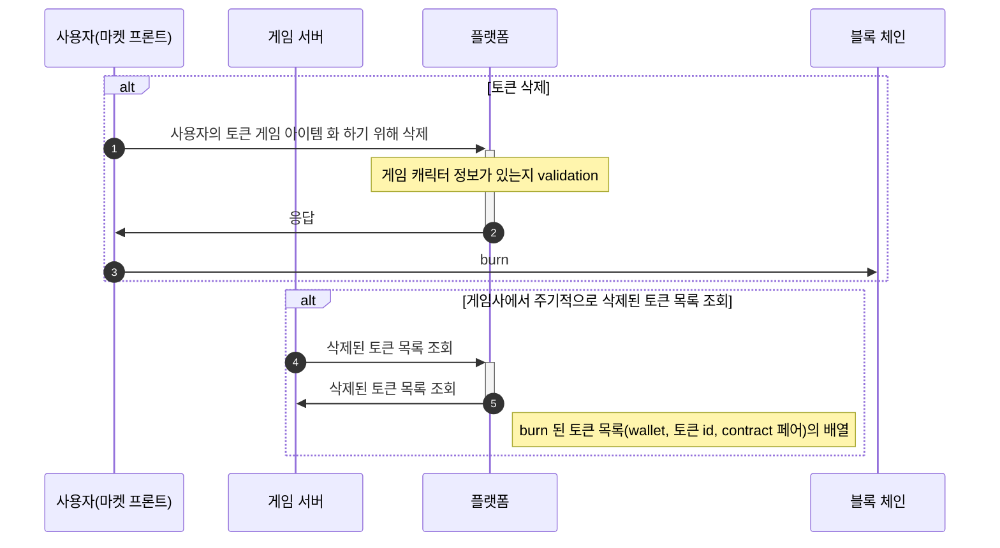
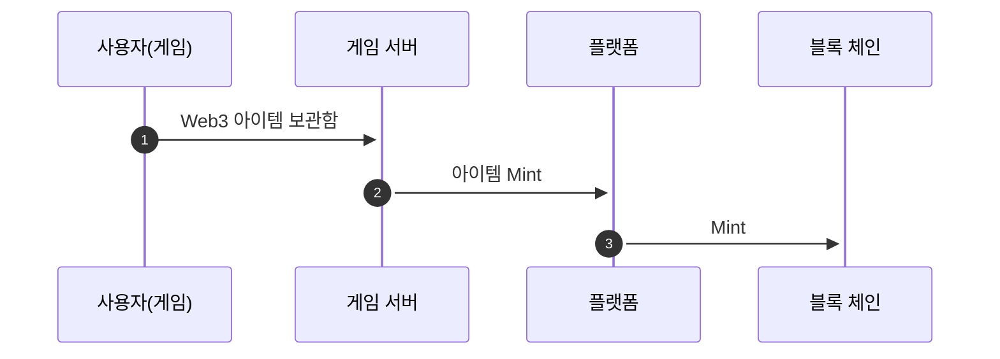

# 토큰 발행 & 삭제(Ramp)
> [Open Api ui](%partner-api-base%/ramp/swagger-ui/index.html)

## 개요

이 문서는 게임사에서 아이템을 토큰(NFT)으로 발행 하거나 삭제 하는 FLOW 를 설명하고 있습니다.

모든 통신은 보안 조치를 위해, 게임 클라이언트에서 요청할 수 없고 게임사 서버에서만 요청할 수 있습니다.

### 용어

다음은 해당 문서를 이해하기 위해 필요한 용어 목록입니다

| 용어               | 의미                                                                                                           | 동의어                              |
|------------------|--------------------------------------------------------------------------------------------------------------|----------------------------------|
| 민트(mint)         | 새로운 토큰을 블록체인에 생성하는 행위. ERC-721 에서 새로운 토큰은 새로운 id 를 가지고, ERC-1155 에선 새로운 id 로 민팅 할 수 있고, 기 존재하던 id 로 민팅할 수 있음 | 민팅(minting)                      |
| 토큰 발행            |                                                                                                              |                                  |
| 번(burn)          | 블록체인에서 토큰을 삭제하는 행위. ERC-721 에서 토큰 id 를 지정해서 삭제할 수 있고, ERC-1155 에서 토큰 id 와 삭제할 수량을 지정해서 삭제할 수 있음.             | 토큰 소각                            |
| ERC-721          | 각 토큰이 고유한 가치를 지닌 스마트 컨트랙트 표준                                                                                 |                                  |
| ERC-1155         | 같은 가치를 지닌 토큰이 여러개 있을 수 있는 스마트 컨트랙트 표준                                                                        |                                  |
| 컨트랙트             | 스마트 컨트랙트 약어                                                                                                  | 스마트 컨트랙트(Smart contract 이하, SMC) |
| minterKey        | 토큰을 민트할 수 있는 키(플랫폼이 보유함)                                                                                     |                                  |
| 요청 id(requestId) | 게임사 서버에서 발행한, 요청을 식별할 수 있는 고유값                                                                               |                                  |
| 플랫폼              | 토큰의 발행과 삭제처리하고, 해당 내용을 조회할 수 있는 API 서버                                                                       |                                  |
| 게임 서버            | 토큰의 발행과 삭제, 내역 조회를 요청할 수 있는 서버                                                                               |                                  |
| 토큰 메타데이터         | 토큰의 id 와 컨트랙트 주소                                                                                             |                                  |
| 아이템 메타데이터        | 토큰의 메타데이터 (ERC-721 혹은 opensea 스펙)                                                                            |                                  |
| ON RAMP          | WEB2 아이템을 WEB3 아이템(NFT)으로 교환                                                                                 |                                  |
| OFF RAMP         | WEB3 아이템을 WEB2 아이템(NFT)으로 교환                                                                                 |                                  |

### 토큰 종류

토큰화 하려는 아이템의 성격에 따라 ERC-721 표준과, ERC-1155 표준을 가진 스마트 컨트랙트로 정의될 수 있습니다.

한개의 게임은 1개의 ERC-1155 컨트랙트와 N 개의 ERC-721 컨트랙트를 가질 수 있습니다.

#### ERC-721 {collapsible="true"}

모든 토큰(아이템) 이 고유한 가치를 지닙니다.

예를들어, 디아블로의 아이템을 생각해 볼 때, 같은 이름을 지닌 아이템이더라도 상옵, 하옵 등으로 나눠질 수 있고, 모든 아이템은 각각의 고유한 가치를 가집니다.

- 예시 이미지
  
  
  같은 바람살 아이템이지만, 디테일한 능력치가 다릅니다.


#### ERC-1155 {collapsible="true"}

한 컨트랙트에 같은 id 를 가진 토큰이 여러개 있을 수 있습니다.

같은 id 를 가진 토큰들은 같은 가치를 지닙니다.

예를들어, 디아블로의 포션 등, 한개의 아이템 칸에 겹칠 수 있고, 전부 같은 가치를 지니는 아이템을 생각할 수 있습니다.

- 예시 이미지

  

  체력 회복량 250을 가진 최하급 체력 포션(ID: 1)

  마력 회복량 250을 가진 최하급 마력 포션(ID: 2)

  체력 회복량 400을 가진 하급 체력 포션(ID: 3)

  마력 회복량 400을 가진 하급 마력 포션(ID: 4)

  한 캐릭터는 최하급 체력 포션을 여러개 가질 수 있고, 다른 캐릭터가 가진 최하급 체력 포션과 같은 가치를 가집니다


### 아이템 메타데이터

토큰의 가치를 표시하고, 마켓에서 토큰의 정보를 표시하기 위해 일반적인 기준을 가진 토큰 메타데이터를 게임사에서 제공해야 합니다.

[링크](https://docs.opensea.io/docs/metadata-standards#section-metadata-structure)는  opensea 에서 정의한 메타데이터 스펙이지만, 일반적인 nft 마켓플레이스에서 통용되는 규약이기에 해당 스펙으로 가름합니다.

## FLOW

**모든 요청시 API Path에 RequestId를 포함해야합니다.**

### 토큰 발행(MINT)
요청 예시
```json
  {
  "items": [
    {
      "userId": "eb1011234c64cd39de9f1115601e8d4",
      "metadata": {
        "name": "sword",
        "description": "this is a sword.",
        "attributes": [
          {
            "traitType": "attack damage",
            "value": "100"
          },
          {
            "traitType": "attack speed",
            "value": "35"
          }
        ]
      },
      "itemType": "0xe8a70ffdb6842efa5ba5bd5430e27254d4f7341f",
      "itemId": 1
    }
  ]
}
```
#### 아이템 민팅 요청 요소

| 파라미터 이름 | 타입   | 설명                            |
|---------------|------|---------------------------------|
| items         | List | 아이템 목록                     |

#### items 배열의 요소

| 파라미터 이름   | 타입    | 설명                          |
|-----------|---------|-----------------------------|
| userId    | String  | 사용자 uid                     |
| metadata  | String  | OpenSea 사양 메타데이터 JSON 문자열   |
| itemType  | String  | 아이템 타입 식별자                  |
| itemId    | String  | 아이템 ID                      |
| amount    | Integer | 수량 (ERC1155 경우만) 아닌 경우 포함 안해도 됩니다. |


#### MetaData 요소

| 필드 이름       | 타입     | 설명          |
|-------------|--------|---------------|
| name        | String | 이름          |
| description | String | 설명          |
| attributes  | List   | 속성 목록     |

#### Attributes 요소

| 필드 이름     | 타입   | 설명          |
|-----------|--------|---------------|
| traitType | String | 속성 유형     |
| value     | String | 속성 값       |

#### 아이템 민팅 응답

응답 예시
```json
  {
    "requestId": "5d5bbb5e-7c6d-4654-a519-f3ae8cb0646d"
  }
```

| 파라미터 이름 | 타입    | 설명                            |
|---------------|---------|---------------------------------|
| requestId     | String  | 요청 고유 id                    |


#### 민팅 요청 흐름도


### 토큰 발행 상태 조회

#### 토큰 발행 상태 조회 응답 요소

응답 예시
```json
  {
    "requestId": "5d5bbb5e-7c6d-4654-a519-f3ae8cb0646d",
    "status": "SUCCESS"
  }
```

| 파라미터 이름   | 타입    | 설명                         |
|-----------|---------|----------------------------|
| requestId | String  | 요청 고유 id                   |
| status    | String  | PENDING or SUCCESS or FAIL |

#### 민팅 상태 조회 흐름도


### 삭제(BURN)된 토큰 목록 조회

#### 토큰 발행 상태 조회 응답 요소

응답 예시
```json
 [
  {
    "userId": "userId",
    "itemType": "0xe8a70ffdb6842efa5ba5bd5430e27254d4f7341f",
    "itemId": "sword-1"
  }
]
```
| 파라미터 이름  | 타입    | 설명         |
|----------|---------|------------|
| userId   | String  | 사용자 uid    |
| itemType | String  | 아이템 타입 식별자 |
| itemId   | String  | 아이템 ID     |

#### 삭제된 토큰 목록 조회 흐름도



## OnOffRamp 예상 흐름도

### 예상 On Ramp 흐름도


### 예상 Off Ramp 흐름도
